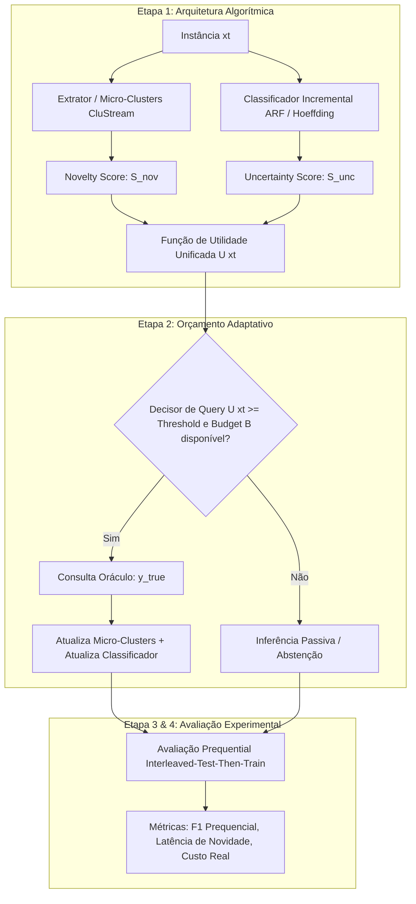

# Proposta de Pesquisa Científica

## 1. Identificação do Projeto

* **Título Proposto (PT):** *Aprendizado Ativo Guiado por Detecção de Novidades em Fluxos Contínuos de Dados sob Restrição Estrita de Orçamento*
* **Título Proposto (EN):** *Novelty-Aware Active Learning for Non-Stationary Data Streams under Strict Budget Constraints*
* **Eixos Temáticos:** *Data Streams* • *Active Learning* • *Novelty / Out-of-Distribution Detection* • *Incremental Machine Learning*
* **Ferramentas / Frameworks:** Python, CapyMOA, River.

---

## 2. Contextualização e Formulação do Problema (*Problem Statement*)

### 2.1. O Cenário Formal
Seja um fluxo contínuo de dados não-estacionário $S = \{(x_1, y_1), (x_2, y_2), \dots, (x_t, y_t), \dots\}$, onde a cada instante $t$, uma instância $x_t \in \mathbb{R}^d$ é observada, mas seu rótulo $y_t \in \mathcal{Y}_t$ é desconhecido e omitido por padrão.

Diferente do aprendizado supervisionado clássico em lote (*batch*), dois desafios ocorrem simultaneamente:
1. **Espaço de Classes Aberto e Dinâmico ($\mathcal{Y}_t \neq \mathcal{Y}_{t-1}$):** O número de classes não é estático. Novas classes não catalogadas previamente (novelties) podem emergir no fluxo a qualquer instante $t$.
2. **Restrição de Acesso ao Oráculo (Budget $B$):** Obter o rótulo verdadeiro $y_t$ de um especialista humano possui custo elevado. O sistema opera sob um orçamento restrito $B \in (0, 1]$, podendo consultar o oráculo para no máximo uma fração $B$ do total de instâncias em uma janela temporal $W$.

### 2.2. A Lacuna Científica (*The Scientific Gap*)
* **Abordagens de Active Learning em Streams:** Focam em instâncias na fronteira de decisão entre classes conhecidas (*uncertainty sampling*). Pressupõem implicitamente um espaço de classes fechado $\mathcal{Y}$. Quando uma instância de uma classe inédita $y_{new} \notin \mathcal{Y}$ aparece, o modelo ou a classifica incorretamente com alta confiança errônea, ou mede incertezas espúrias entre classes conhecidas, falhando em isolar a novidade.
* **Abordagens de Novelty Detection em Streams:** Algoritmos como MINAS, ECSMiner ou CluStream agrupam anomalias em *micro-clusters* não-supervisionados, mas assumem que os rótulos de classes conhecidas estão sempre disponíveis ou operam de forma passiva, sem uma política de consulta ativa sob restrição formal de custo ($B$).

**A Pergunta de Pesquisa:** *Como formular uma estratégia de aquisição unificada que aloque eficientemente um orçamento restrito $B$ de rotulagem, priorizando a identificação precoce de novas classes sem degradar a acurácia de fronteira nas classes pré-existentes?*

---

## 3. Hipótese Científica e Objetivos

### 3.1. Hipótese
> $H_1$: *Uma estratégia de query híbrida que pondera a densidade espacial de representação não-supervisionada (novelty score) juntamente com a incerteza probabilística do classificador incremental atinge um F1-Score significativamente superior em classes emergentes, com menor latência de detecção e mesmo consumo de budget, quando comparada a estratégias tradicionais de Active Learning puro e Novelty Detection isolado.*

### 3.2. Objetivos
* **Objetivo Geral:** Desenvolver, formalizar e avaliar empiricamente um framework algorítmico integrado de *Novelty-Aware Active Stream Learning* (NAASL) para classificação incremental em fluxos de dados sob restrição de rotulagem.
* **Objetivos Específicos:**
  1. Formalizar a função de utilidade de consulta $U(x_t)$ que combina incerteza de classificação e escore de novidade.
  2. Implementar um gerenciador adaptativo de orçamento que evite o esgotamento precoce do budget ($B$) por falso-positivos de novidade (ruídos).
  3. Construir um protocolo experimental rigoroso com fluxos sintéticos controlados e datasets reais não-estacionários.
  4. Analisar a latência de detecção de classes novas e a degradação de desempenho sob diferentes níveis de orçamento ($B \in \{2\%, 5\%, 10\%, 20\%\}$).

---

## 4. Metodologia Detalhada por Etapas de Pesquisa



---

### Etapa 1 — Formalização Algorítmica da Função de Utilidade Híbrida

Deverá ser definido o cálculo da função de aquisição $U(x_t) \in [0, 1]$ para cada amostra $x_t$ que chega no fluxo:

1. **Escore de Incerteza ($S_{unc}(x_t)$):**
   Calculado a partir da distribuição de probabilidades a posteriori $P(y|x_t)$ dada pelo classificador incremental (ex: *Adaptive Random Forest* ou *Hoeffding Tree*):
   $$S_{unc}(x_t) = 1 - \max_{c \in \mathcal{Y}} P(y=c \mid x_t) \quad \text{ou via Entropia de Shannon: } -\sum_{c} P(y=c \mid x_t) \log P(y=c \mid x_t)$$

2. **Escore de Novidade ($S_{nov}(x_t)$):**
   Manutenção de um conjunto de micro-clusters estatísticos (sumários de média $\mu_k$, raio $r_k$, e peso $w_k$). A novidade é expressa pela distância normalizada ao micro-cluster mais próximo:
   $$S_{nov}(x_t) = \min_{k} \frac{\|x_t - \mu_k\|_2}{r_k + \epsilon}$$

3. **Combinação de Utilidade:**
   $$U(x_t) = \alpha \cdot \phi(S_{nov}(x_t)) + (1 - \alpha) \cdot S_{unc}(x_t)$$
   Onde $\phi(\cdot)$ é uma função de ativação não-linear (ex: Sigmoide com limiar) que atua como gatilho prioritário quando a instância se encontra muito afastada do espaço conhecido, e $\alpha \in [0, 1]$ é o balanceador.

---

### Etapa 2 — Gerenciamento e Alocação Dinâmica de Orçamento (*Budgeting*)

Em fluxos contínuos, um perigo clássico é a exaustão prematura do orçamento (*Budget Exhaustion*): gastar todo o limite nos primeiros $1.000$ exemplos e ficar "cego" quando uma nova classe surgir no exemplo $10.000$.

* **Mecanismo Proposto:** *Variable-Threshold Randomized Budgeting*.
  * O limiar para aceitar a query varia dinamicamente com base no consumo recente do orçamento em uma janela deslizante $W$.
  * Se o consumo recente $\hat{B}_t > B_{alvo}$, o limiar de corte é elevado exponencialmente, exigindo instâncias com escore de novidade/incerteza ainda mais extremos para disparar uma query.

---

### Etapa 3 — Protocolo Experimental e Benchmarks

#### A. Datasets Sintéticos (Controle de Variáveis)
Gerados via [CapyMOA](https://capymoa.org/) / MOA com timestamps exatos de injeção de novidade:
1. **RandomRBF Drift Stream:** Injeção abrupta de novas classes em $t = 25.000$ e $t = 50.000$.
2. **Rotating Hyperplane:** Injeção de novas classes com deriva contínua e gradual nos atributos.

#### B. Datasets Reais Não-Estacionários
1. **Forest Covertype:** 581.012 instâncias, 7 classes de cobertura florestal. Protocolo: treinar inicialmente com 3 classes; introduzir as classes 4 a 7 sequencialmente ao longo do stream.
2. **CIC-IDS2017 / UNSW-NB15:** Dados temporais de tráfego de rede, onde novas famílias de ataque aparecem exclusivamente nos dias 3, 4 e 5.

#### C. Métodos de Comparação (*Baselines*)
Para isolar a contribuição, o framework proposto será comparado contra:
1. **Random Sampling:** Consulta o oráculo aleatoriamente com probabilidade $B$.
2. **Standard Active Learning (Stream AL):** Uncertainty sampling clássico (sem consciência de novidade).
3. **Pure Novelty Detection:** MINAS / ECSMiner operando sem restrição de budget.
4. **Full Oracle (Upper Bound):** Modelo supervisionado 100% rotulado.

---

### Etapa 4 — Métricas Científicas Padronizadas

A avaliação adotará o protocolo padrão de streams **Prequential Evaluation (Interleaved-Test-Then-Train)**:

| Métrica | Símbolo | Significado Científico |
|---|:---:|---|
| **Prequential Macro-F1** | $\overline{F1}_{preq}$ | Desempenho balanceado médio ao longo do tempo em todas as classes. |
| **Novelty Detection F-Score** | $F_{new}$ | Eficiência específica em identificar e classificar instâncias de classes inéditas. |
| **Latência de Detecção** | $\Delta t_{nov}$ | Quantidade de instâncias transcorridas entre o surgimento da classe nova e sua 1ª query ao oráculo. |
| **Taxa de Falso Alarme de Novidade** | $M_{new}$ | Percentual de instâncias de classes conhecidas erroneamente rotuladas como nova classe (desperdício de budget). |
| **Budget Efficiency Ratio** | $E_B$ | Razão entre o ganho de acurácia obtido e a porcentagem de queries realizadas. |

---

### Etapa 5 — Análise Estatística e Sensibilidade

* **Testes de Hipótese:** Como os experimentos serão rodados em múltiplos fluxos e com diferentes sementes aleatórias ($N=10$ repetições), será aplicado o **Teste dos Postos Sinalizados de Wilcoxon** (para comparações par a par) e o **Teste de Friedman com pós-teste de Nemenyi** para verificar a dominância estatística do método frente a múltiplos baselines ($p < 0.05$).
* **Estudo de Ablação:**
  * O que acontece se removermos o termo $S_{nov}$? (Reduz a AL puro).
  * O que acontece se removermos o termo $S_{unc}$? (Reduz a clustering puro).
  * Como a latência de novidade varia em função de $B \in [0.01, 0.20]$?

---

## 5. Cronograma Executivo de Desenvolvimento (Sprints)

```
[Semana 1-2] Levantamento e Formalização Matemática + Setup do CapyMOA/River
     │
[Semana 3-4] Implementação do Algoritmo NAASL + Módulo de Micro-Clusters e Budgeting
     │
[Semana 5-6] Execução dos Experimentos em Streams Sintéticos + Calibração de Parâmetros
     │
[Semana 7-8] Execução dos Experimentos em Datasets Reais + Coleta de Métricas
     │
[Semana 9]   Testes Estatísticos de Hipótese, Gráficos de Convergência e Ablação
     │
[Semana 10]  Redação Final do Artigo Científico / Relatório de Projeto Integrado
```

---

## 6. Diferenciais e Contribuições Científicas do Trabalho

1. **Originalidade:** É a primeira proposta documentada na literatura dos 15 artigos base a fechar a lacuna explícita entre *Active Learning sob Budget* e *Novelty Detection em Data Streams*.
2. **Reprodutibilidade:** Código-fonte e pipelines de dados construídos sobre ecossistemas abertos modernos ([CapyMOA](https://capymoa.org/) / [River](https://riverml.xyz/)).
3. **Aplicabilidade Transversal:** O método gerado serve diretamente para fraudes financeiras, intrusão em redes, falhas industriais e sensores IoT sem necessitar de customizações de arquitetura.